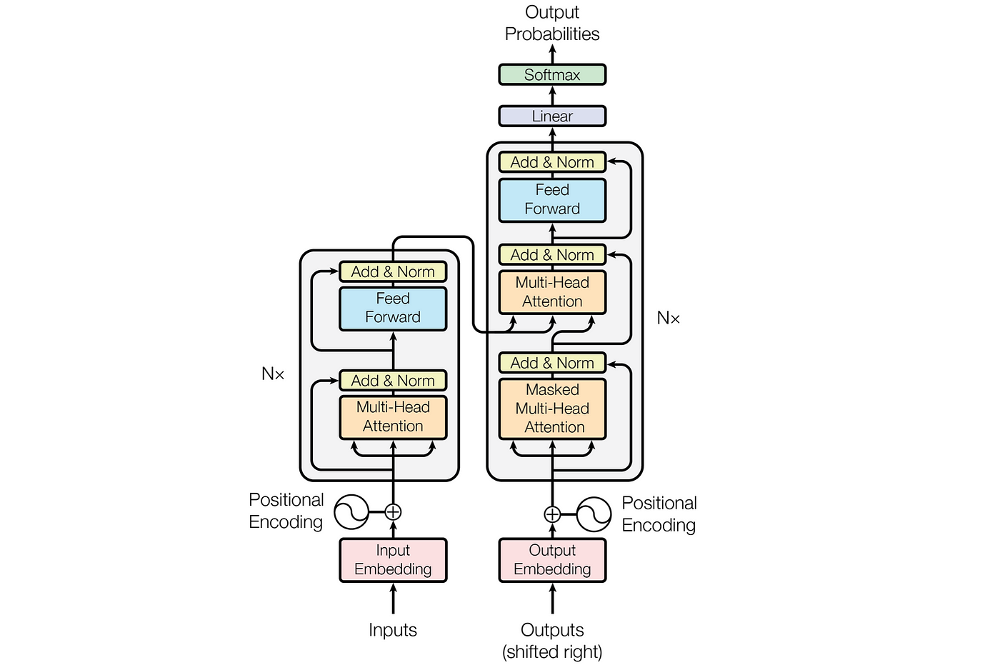

# GPT-Transformers

This repo is built on a basic implementation of transformers: `Generative Pre-Trained Transformer.` as designed by Radford et al. in their paper *"Improving Language Understanding by Generative Pre-Training"*  

It is important to note that GPT is an `encoder-decoder` model, unlike the other versions of GPT that we all currently use.  

The architecture has the following modules:
- **MHSA**: Multi-headed self attention
- **FeedForward Network**: Connects MHSA to linear projection for transforming *embedding dimension* to *vocabulary size**
- **Block**: Wrapper around MHSA and FeedForward Network
- **MiniGPT**: Holy Grain Wrapper of all the modules.

The model is trained for *500 epochs* each for *300 steps* on Shakespearean Text dataset that you can find here:  
`https://raw.githubusercontent.com/karpathy/char-rnn/master/data/tinyshakespeare/input.txt`  

There is a detailed notebook, `playground.ipynb,` which gives a walkthrough of a tokenizer, causal masked attention, bigram language modeling, and many more. It can serve as a pre-requisite before tinkering with the master Python file.  

To run training, run the following command on the terminal `!python train.py`. Note that this file will automatically start to infer on a sample sentence provided within the master file.
